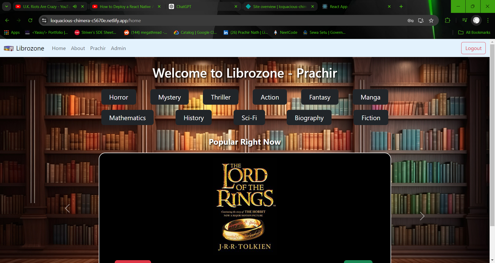
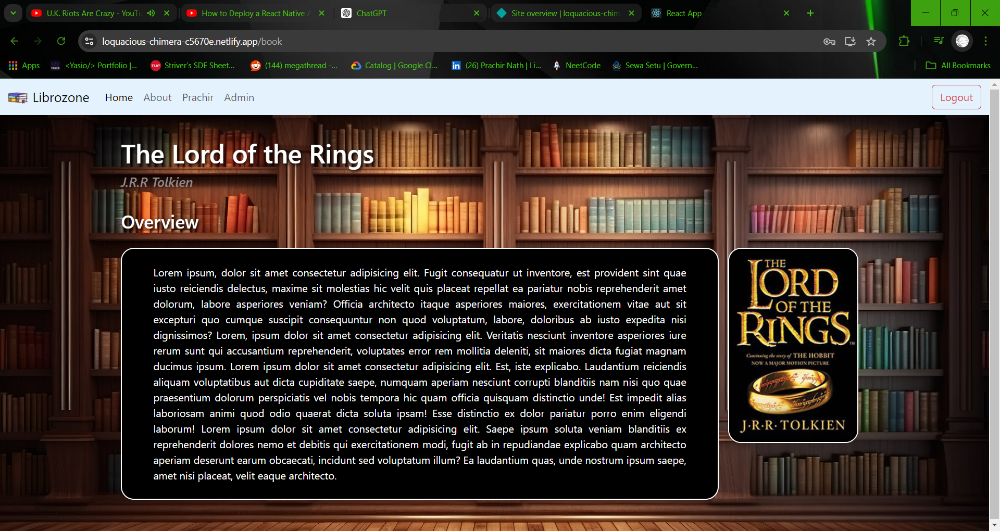
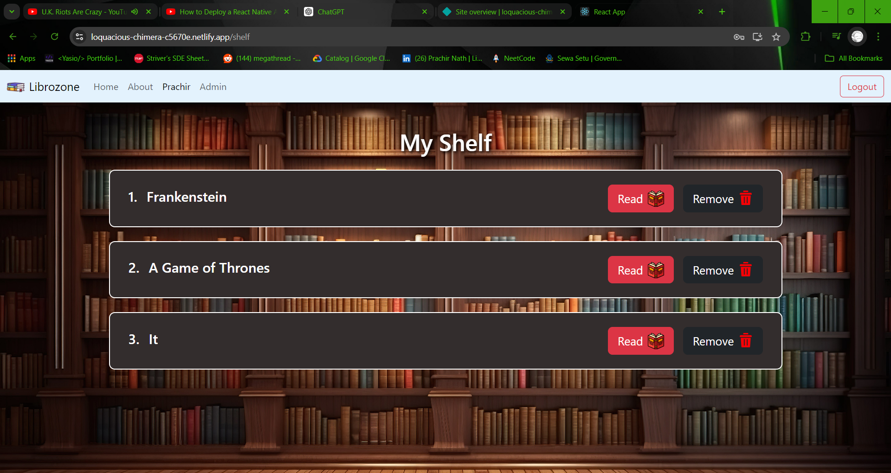
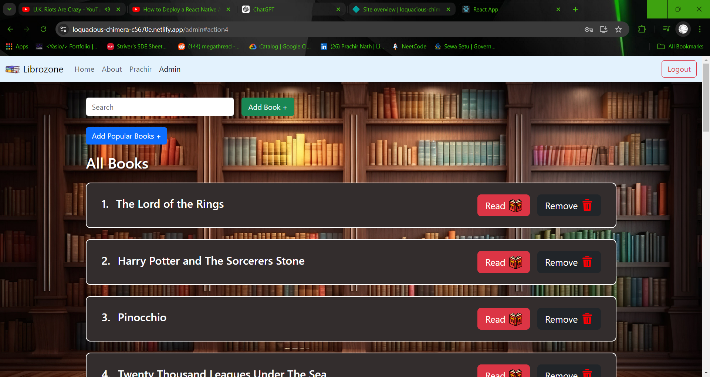

Welcome to the Library Management System, a full-featured web application developed using the MERN stack. This platform provides users with a dynamic and interactive way to explore a vast collection of books. With a user-friendly interface, you can easily sign up, log in, and browse through different categories of books tailored to your interests.

Once logged in, you have the option to read books directly on the platform or save them to your personal library for later reading. The application is designed to offer a seamless reading experience, whether you're looking to dive into a new book immediately or curate a list of favorites for future enjoyment.

For the purposes of this demonstration, the site also includes an admin panel. This exclusive feature is available only during the demo and is not accessible to regular users. The admin panel allows administrators to manage the book collection, including adding new titles or removing existing ones. This feature showcases the platform's scalability and ease of content management. Please note that in a production environment, access to the admin panel would be restricted to authorized personnel only.

The demo is currently not responsive for mobile devices and a PC is recommended for viewing it.

Start the server first: https://librozone-react.onrender.com

Check out the demo website here: https://loquacious-chimera-c5670e.netlify.app/

# 1. Landing page on user login -

Users can explore books across various categories, selecting their favorites to read immediately or save to their Shelf for later. Additionally, they can browse through tags such as popular books, upcoming releases, discounted titles, and more, making it easy to discover books that match their interests.

# 2. Book Reading Page -

This is the layout of the book reading page. While it currently contains placeholder text, publishers will have the option to add the full content of any book.

# 3. Shelf -

This is the Shelf page where a user can save any books to read later.

# 4. Admin -

This is the admin page, which features a highly protected route. For the demo, it will be accessible to all users. The admin page allows administrators to add or remove books from the website, search for books by name, and categorize them into sections like Popular Books, Discounted Books, and more.
